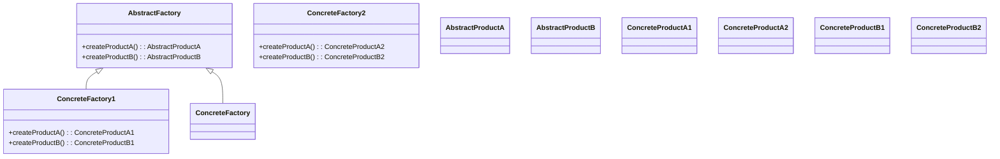

```mermaid
classDiagram
    class AbstractFactory {
        +createProductA(): AbstractProductA
        +createProductB(): AbstractProductB
    }
    class ConcreteFactory1 {
        +createProductA(): ConcreteProductA1
        +createProductB(): ConcreteProductB1
    }
    class ConcreteFactory2 {
        +createProductA(): ConcreteProductA2
        +createProductB(): ConcreteProductB2
    }
    class AbstractProductA
    class AbstractProductB
    class ConcreteProductA1
    class ConcreteProductA2
    class ConcreteProductB1
    class ConcreteProductB2
    AbstractFactory <|-- ConcreteFactory1
    AbstractFactory <|-- ConcreteFactory

```
