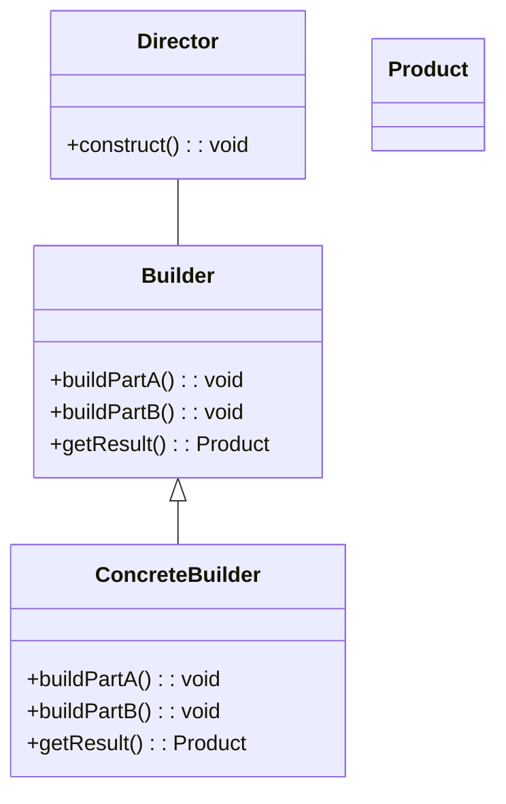

```mermaid
classDiagram
    class Director {
        +construct(): void
    }
    class Builder {
        +buildPartA(): void
        +buildPartB(): void
        +getResult(): Product
    }
    class ConcreteBuilder {
        +buildPartA(): void
        +buildPartB(): void
        +getResult(): Product
    }
    class Product
    Director -- Builder
    Builder <|-- ConcreteBuilder
```
