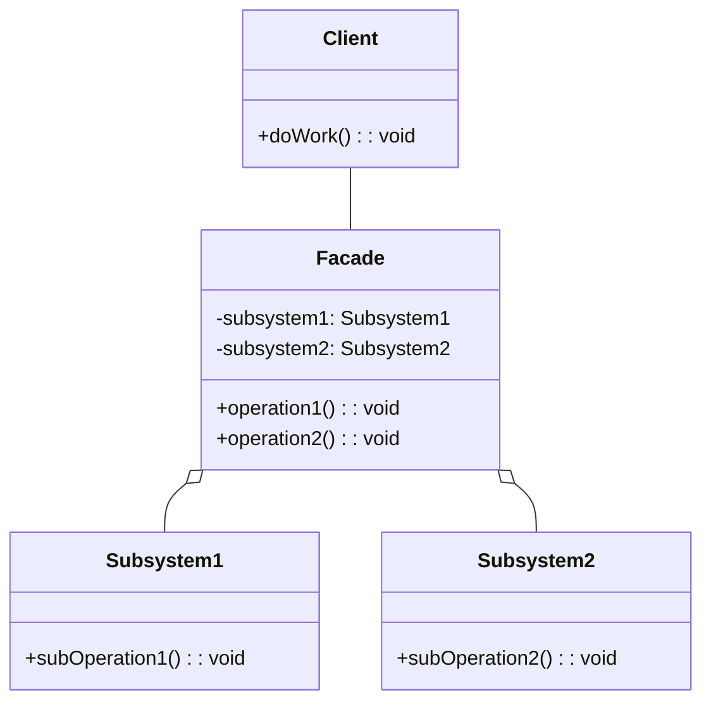

```mermaid
classDiagram
    class Client {
        +doWork(): void
    }
    class Facade {
        -subsystem1: Subsystem1
        -subsystem2: Subsystem2
        +operation1(): void
        +operation2(): void
    }
    class Subsystem1 {
        +subOperation1(): void
    }
    class Subsystem2 {
        +subOperation2(): void
    }
    Client -- Facade
    Facade o-- Subsystem1
    Facade o-- Subsystem2
```
