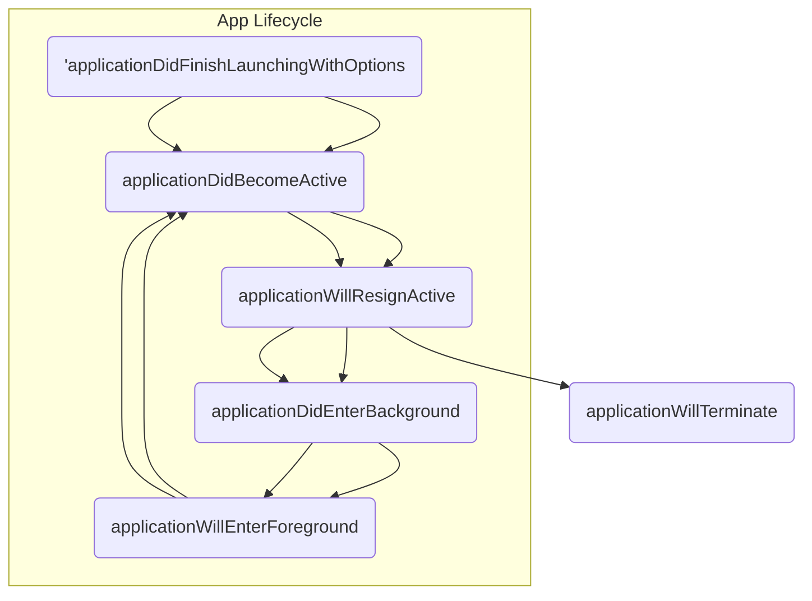

```mermaid
graph TB
    A('applicationDidFinishLaunchingWithOptions) --> B(applicationDidBecomeActive)
    B --> C(applicationWillResignActive)
    C --> D(applicationDidEnterBackground)
    D --> E(applicationWillEnterForeground)
    E --> B
    C --> F(applicationWillTerminate)
    subgraph App Lifecycle
        A --> B --> C --> D --> E --> B
    end
```
