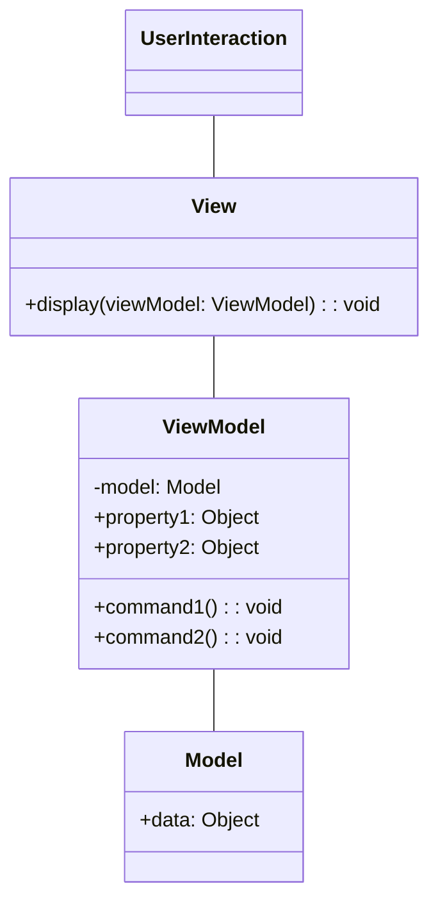

This diagram shows the main components of the MVVM architecture:

Model: Represents the application data and business logic.

View: Represents the user interface and visual elements.

ViewModel: Acts as an intermediary between the View and Model, exposing properties and commands for data binding and user interactions.
Additionally, a UserInteraction class represents user interactions with the View. The View communicates with the ViewModel, which in turn communicates with the Model. This separation of concerns promotes a more maintainable and testable architecture.

