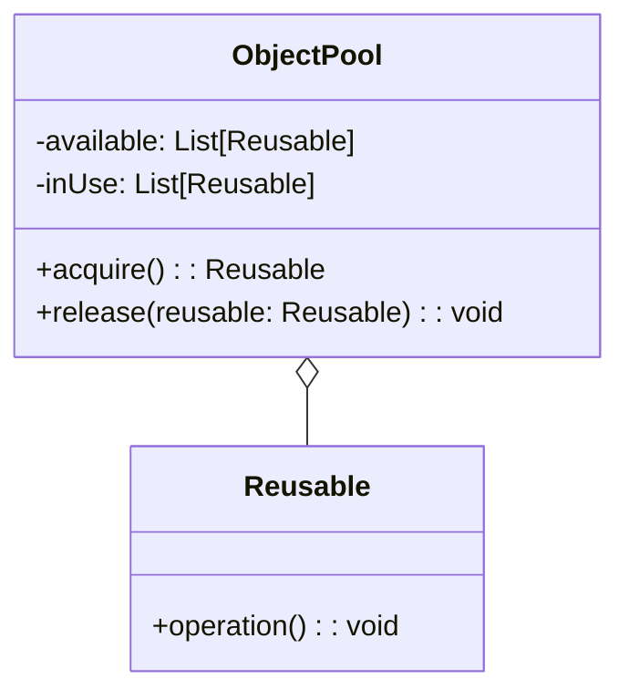

```mermaid
classDiagram
    class ObjectPool {
        -available: List[Reusable]
        -inUse: List[Reusable]
        +acquire(): Reusable
        +release(reusable: Reusable): void
    }
    class Reusable {
        +operation(): void
    }
    ObjectPool o-- Reusable

```
