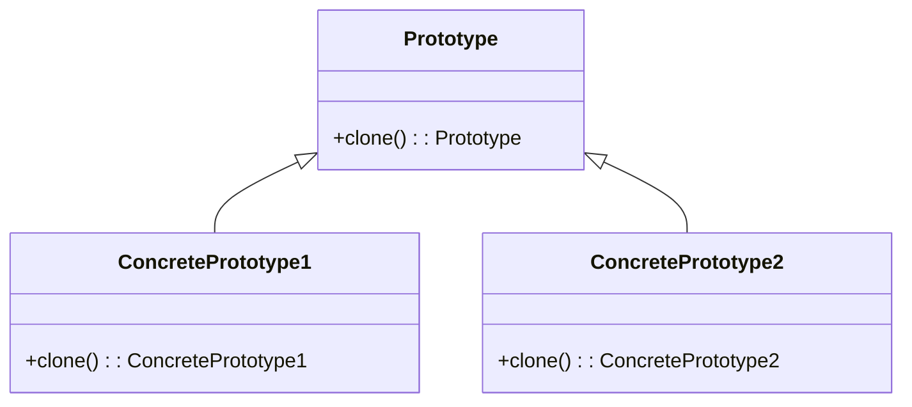

```mermaid
classDiagram
    class Prototype {
        +clone(): Prototype
    }
    class ConcretePrototype1 {
        +clone(): ConcretePrototype1
    }
    class ConcretePrototype2 {
        +clone(): ConcretePrototype2
    }
    Prototype <|-- ConcretePrototype1
    Prototype <|-- ConcretePrototype2
```
