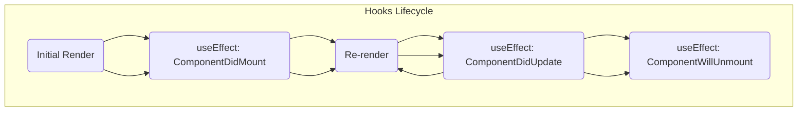

```mermaid
graph TB
    A(Initial Render) --> B(useEffect: ComponentDidMount)
    B --> C(Re-render)
    C --> D(useEffect: ComponentDidUpdate)
    D --> C
    D --> E(useEffect: ComponentWillUnmount)
    subgraph Hooks Lifecycle
        A --> B --> C --> D --> E
    end
```
