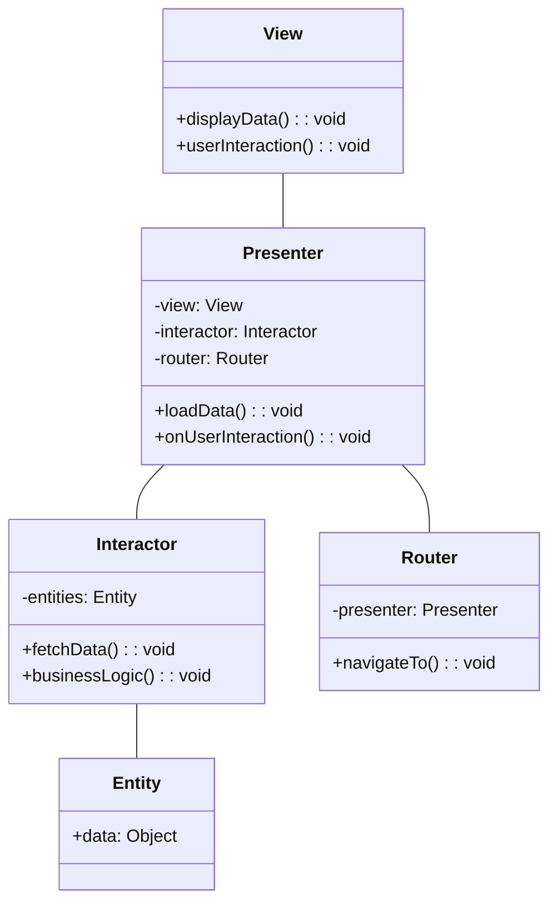

```mermaid
classDiagram
    class View {
        +displayData(): void
        +userInteraction(): void
    }
    class Presenter {
        -view: View
        -interactor: Interactor
        -router: Router
        +loadData(): void
        +onUserInteraction(): void
    }
    class Interactor {
        -entities: Entity
        +fetchData(): void
        +businessLogic(): void
    }
    class Entity {
        +data: Object
    }
    class Router {
        -presenter: Presenter
        +navigateTo(): void
    }
    View -- Presenter
    Presenter -- Interactor
    Presenter -- Router
    Interactor -- Entity
```
